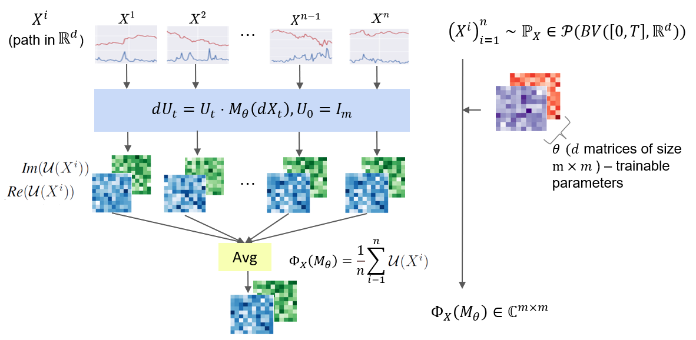

PCF-GAN: generating sequential data via the characteristic function of measures on the path space
========================================
<p align="center">

</p>

This repository is the official implementation of the paper entitled "PCF-GAN: generating sequential data via the characteristic function of measures on the path space". The characteristic function on the path space can be thought of as an extension of the characteristic function on $\mathbb{R}^d$ and is illustrated by the figure above. This work demonstrates its effectiveness in the task of time series generation.  

## Environment Setup
The code has been successfully tested using Python 3.9 and PyTorch 1.7 with GPU support. Therefore, we suggest using this version or a later version of Python and PyTorch. A typical process for installing the package dependencies involves creating a new Python virtual environment.

```console
conda install pytorch torchvision torchaudio pytorch-cuda=11.7 -c pytorch -c nvidia
conda install -c conda-forge cupy cudatoolkit=11.7
pip install git+https://github.com/tgcsaba/ksig.git --no-deps
pip install -r requirements.txt
```
The soruce code of the PCF-GAN is in the [PCF-GAN](src/PCFGAN/) subdirectory.

## Reproducing experiments
 To reproduce the experiments illustrated in the paper, one can use [run.py](run.py) script, which takes two main arguments to specify the GAN model and benchmark dataset, i.e. 
 ```console
 python3 run.py --gan_algo MODEL --dataset DATASET
 ```   
 where `MODEL` is either `PCFGAN`,`TimeGAN`,`COTGAN`,`RCGAN`, `all`, and `DATASET` is either `rough`, `stock`, `air_quality`, `eeg`, `ou`, `all`. Note that `ou` dataset is only compatible with `PCFGAN`. When `all` is specified, the script with execute the task on each model or dataset sequentially.
 
 One can modify YAML file in [configs](configs/) to further specify model parameters. After the model training and evaluation, the related models and plots will be store in the numerical_results folder.

For the hypothesis experiment, one can run with
```console
python3 PCF_HT.py
```
 For the first time user, it will takes some time to generate the dataset automaticall. Since GAN are computationally expensive to train, we also provide trained GAN models stored in [numerical_results](numerical_reuslts.zip), one can creae the numerical_results folder with all trained models on all benckmark datasets by
 ```console
python pretrained_model.py
 ```
 
 We also provide the illustration of the plots in the [notebook](notebooks/numerical.ipynb).
